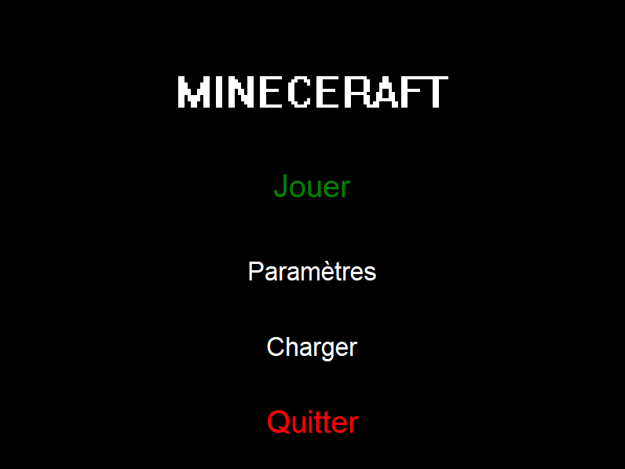
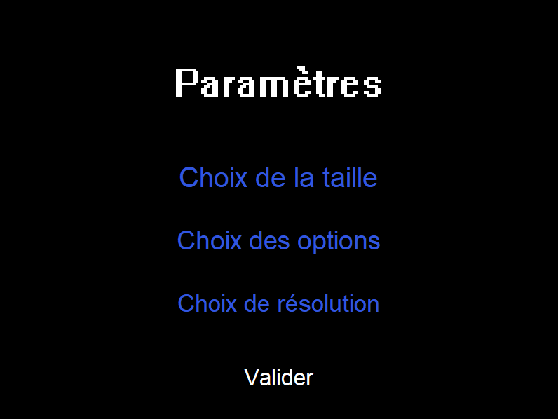
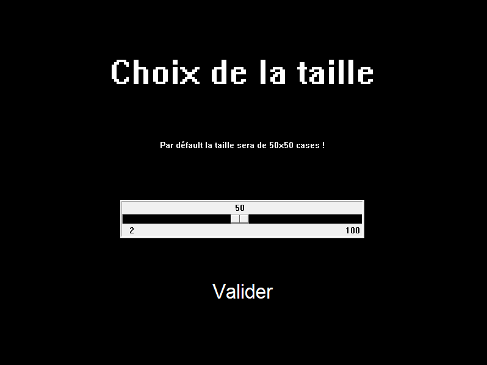
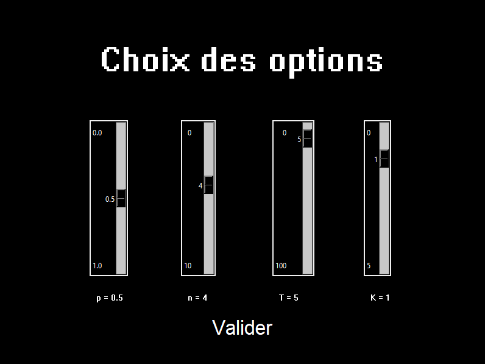
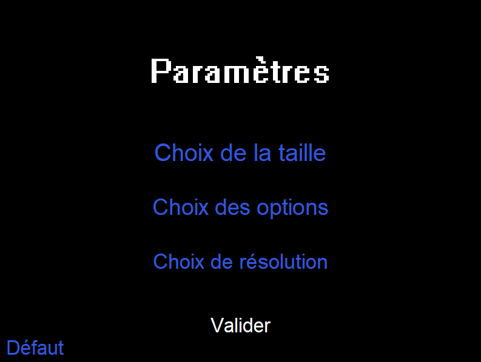
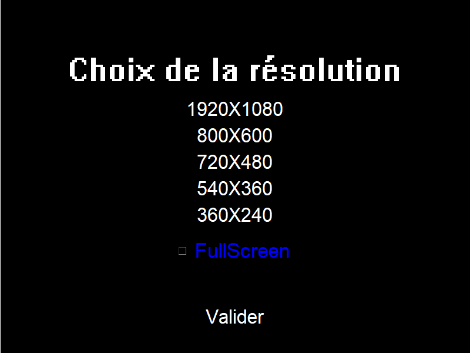
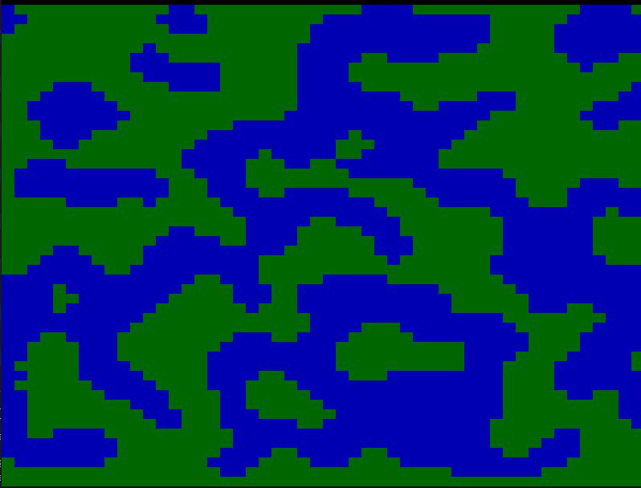

# Projet Génération d'un terrain de jeu vidéo

## Prérequis

L'utilisation du jeu nécessite python 3.8 et la librairie tkinter afin de pouvoir être utilisé.

## Présentation du jeu
Bienvenu dans le jeu **MINECERAFT** un jeu dans lequel VOUS êtes votre propre héros.

Dans ce jeu vous pourrez créer votre propre terrain grâce à l'addition de 6 paramètres.

Toutes les maps que vous y généreriez sont procédurale, c'est-à-dire, n'ont jamais de fin.

## Lancement du jeu

Au lancement du jeu vous pouvez observer 4 choix:

1) Jouer permet tout simplement de lancer le jeu (si vous n'avez changer aucun paramétre alors le jeux se lancera avec les parametres par défaut).

2) Paramétres quant à lui, emmène vers une autre fenêtre dans laquelle nous pourrons changer les différentes options du jeu.

3) Charger permet de charger une partie sauvegardée au préalable.

4) Et enfin quitter ferme le jeu.

# Paramétres

## Paramétres de générations du terrain:
Une fois après avoir appuyé sur paramétres, vous avez les options de génération de terrain regroupées dans **Choix de la taille** et **Choix des options**.

## Choix de la taille :

Vous pouvez ensuite choisir la taille du terrain en hauteur en appuyant sur **Choix de la taille**. La valeur par défaut est 50, la valeur minimale est 2 et maximale est 100.

Apres avoir choisi votre taille, il suffit d'appuyer sur valider.

## Choix des options de génération du terrain :

Vous pouvez choisir ensuite 5 conditions de générations pour le terrain en appuyant sur **Choix des options**.

Vous pouvez ici choisir 5 paramétres p, n, T, k **(voir explications des paramétres partie Code)** ici les valeurs par défaut sont dans l'ordre 0.5, 4, 5 et 1. Pour valider vos choix appuyer sur *valider*.

## Default

Lorsque qu'un changement est effectué dans les paramètres alors un nouveau bouton défaut apparaîtra, remettant toutes les valeurs par défaut.

## Paramétres aditionnel resolution

Cette option permet de choisir la taille de la fenêtre du jeu et vous permet si vous le souhaiter de jouer en plein écran.

Pour cela, il suffit de cliquer sur la taille voulue en pixel (note: les tailles sont en LARGEURxHAUTEUR et la valeur par défaut est 800x600 sans PleinEcran) et de cocher ou non **FullScreen**. Pour revenir au paramètre, il suffit de cliquer sur **Valider**.

# Début du jeu

Une fois après avoir changé les paramètres comme vous le souhaitiez, vous pouvez appuyer sur **Valider** dans la fenêtre des paramètres pour retourner au menu et appuyer sur **jouer**.

C'est ici que votre aventure commence vous placez le personnage d'un **clic gauche** de la souris sur les cases d'herbe, vous le deplacez grâce aux **fléches directionnels** et si vous souhaitez retirer le personnage il suffit de faire un clic sur celui ci.

Pour revenir en arriére dans vos mouvements, vous pouvez effectuer un **CTRL-Z**.

Pour revenir au menu principal il suffit d'appuyer sur **Echap**

Si vous allez au-delà du dixième de l'écran sur la gauche ou la droite, le terrain se décalera.

# Sauvegarder/charger et réinitialisation

Une fois que vous avez générer votre premier terrain et revenu au menu, 4 choix s'offre à vous:

1) Reprendre le jeu en cliquant sur **Reprendre** ayant pris la place de jouer.

2) Sauvegarder votre terrain généré ainsi que l'emplacement de votre personnage en cliquant sur **sauvegarder** et pour ce faire, une fois la fenêtre de fichier ouverte, donner un nom à votre sauvegarde et enregistrer.

3) En cliquant sur **paramètre** vous pouvez encore changer les options. De ce fait, les prochaines parties du terrain qui se générerons le feront par ses nouvelle options. *une fois un terrain générer l'option de changement de taille n'est plus disponible pour la rendre disponible il faut reinitialiser le terrain*

4) Vous pouvez réinitialiser le terrain en cliquant sur **Recommencer** (ATTENTION CETTE OPERATION EST IRRIVERSIBLE) cela détruira le terrain et vous replacera au menu principal *les options reste les mémes apres une réinitialisation*.

Si vous possédez une sauvegarde, vous pouvez à tout moment la charger sur le jeu en cliquant sur **Charger** dans le menu principal.
