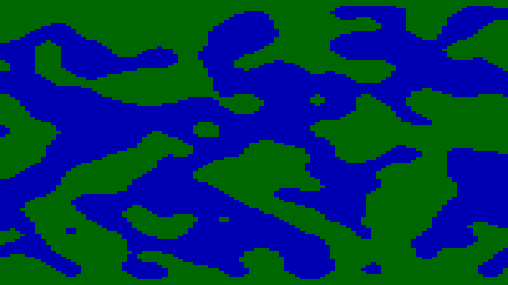

# Projet Génération d'un terrain de jeu vidéo

## Prérequis

L'utilisation du jeu nécessite python 3.8 et la librairie tkinter afin de pouvoir etre utiliser.

## Presentation du jeu
Bienvenue dans le jeu **MINECERAFT** un jeu dans lequel VOUS étes votre propre héros.

Dans ce jeu vous pourrez crée votre propre terrain grace a l'addition de 6 paramétres.

Toutes les maps que vous y généreriez sont procedurale c'est a dire n'ont jamais de fin.

## Lancement du jeu

Au lancement du jeu vous pouvez observez 4 choix:

1) Jouer permet tout simplement de lancer le jeu (si vous n'avez changer aucun paramétre alors le jeux se lancera avec les parametre par defaut).

2) Paramétres quand a lui emmene vers une autre fenetre dans laquelle nous pourrons changer les diferentes options du jeu.

3) Charger permet de charger une partie sauvegarder au préalable.

4) Et enfin quitter ferme le jeu.

# Paramétres

## Paramétres de générations du terrain:
Une fois appuyer sur paramétres vous avez les options de generation de terrain regrouper dans **Choix de la taille** et **Choix des options**.

## Choix de la taille :

Vous pouvez ensuite choisir la taille du terrain en hauteur en appuyant sur **Choix de la taille**. La valeur par default est 50 la valeur minimal est 2 et maximal est 100.

Apres avoir choisi votre taille il suffit d'appuyer sur valider.

## Choix des options de génération du terrain :

Vous pouvez choisir ensuite 5 conditions de générations pour le terrain en appuyant sur **Choix des options**.

Vous pouvez ici choisir 5 paramétres p, n, T, k **(voir explications des paramétres partie Code)** ici les valeurs par defaut sont dans l'ordre 0.5, 4, 5 et 1. Pour valider vos choix appuyer sur *valider*.

## Default

Lorsque qu'un changement est effectué dans les paramétres alors un nouveau boutton defaut apparatera remettant toute les valeurs par defaut.

## Paramétres aditionnel resolution

Cette option permet de choisir la taille de la fenetre du jeu ainsi que si oui ou non vous souhaiter jouer en plein écran.

Pour cela il suffit de cliquer sur la taille voulue en pixel (note: les tailles sont en LARGEURxHAUTEUR et la valeur par defaut est 800x600 sans PleinEcran) et de cocher ou non **FullScreen**. Pour revenir au parametre il suffit de cliquer sur **Valider**.

# Debut du jeu

Une fois avoir changer les parametres comme vous le souhaitiez vous pouvez appuyer sur **Valider** dans la fenetre des paramétre pour retourner au menu et appuyer sur **jouer**.

C'est ici que votre aventure commence vous placer le personnage d'un **clic gauche** de la souris sur les cases d'herbe, vous deplacez grace aux **fléches directionnels** si vous souhaiter retirer le perssonage il suffit de faire un clic sur celui ci.

Pour revenir en arriére dans vos mouvement vous pouvez effectuer un **CTRL-Z**.

Pour revenir au menu principal il suffit d'appuyer sur **Echap**

Si vous allez au de là du dixieme de l'écran sur la gauche ou la droite alors au le terrain se décalera.

# Sauvegarde/charger et reinitialisation

Une fois que vous avez générer votre premier terrain et revenu au menu 4 choix s'offre à vous:

1) Reprendre le jeu en cliquant sur **Reprendre** ayant pris la place de jouer.

2) Sauvegarder votre terrain générer ainsi que l'emplacement de votre perssonage en cliquant sur **sauvegarder**, pour ce faire, une fois la fenetre de fichier ouverte donné un nom a votre sauvegarde et enregistrer.

3) En cliquant sur **paramétre** vous pouvez encore changer les options. De ce fait les prochaines partie du terrain qui se générerons le feront par ses nouvelle options. *une fois un terrain générer l'option de changement de taille n'est plus disponible pour la rendre disponible il faut reinitialiser le terrain*

4) Vous pouvez reinitialiser le terrain en cliquant sur **Reccomencer** (ATTENTION CETTE OPERATION EST IRRIVERSIBLE) cela détruira le terrain et vous replacera au menu principal *les options reste les mémes apres une reinitialisation*.

Si vous posseder une sauvegarde vous pouvez a tout moment la charger sur le jeu en cliquant sur **Charger** dans le menu principal.